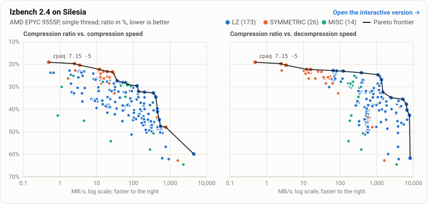

Introduction
-------------------------

lzbench is an in-memory benchmarking tool for open-source compressors. It integrates all compressors into a single executable. Initially, an input file is loaded into memory, after which each compressor is used to compress and decompress the file, ensuring the decompressed output matches the original. This method provides the advantage of compiling all compressors with the same compiler and optimizations. However, it requires access to the source code of each compressor, meaning e.g. Slug and lzturbo are not included.


|Status   |
|---------|
| [![Build Status][AzurePipelinesMasterBadge]][AzurePipelinesLink] |

[AzurePipelinesMasterBadge]: https://dev.azure.com/inikep/lzbench/_apis/build/status%2Finikep.lzbench?branchName=master "gcc and clang tests"
[AzurePipelinesLink]: https://dev.azure.com/inikep/lzbench/_build/latest?definitionId=19&branchName=master

The list of changes in lzbench is available in the [CHANGELOG](CHANGELOG).

Contributor information can be found in [CONTRIBUTING.md](CONTRIBUTING.md).


Usage
-------------------------

```
usage: lzbench [options] input [input2] [input3]

For example:
  lzbench -ezstd filename = selects all levels of zstd
  lzbench -ebrotli,2,5/zstd filename = selects levels 2 & 5 of brotli and zstd
  lzbench -t3,5 fname = 3 sec compression and 5 sec decompression loops
  lzbench -t0,0 -i3,5 fname = 3 compression and 5 decompression iterations
  lzbench -o1c4 fname = output markdown format and sort by 4th column
  lzbench -ezlib -j -r dirname/ = test zlib on all files in directory, recursively
```

For complete list of options refer to [manual](doc/lzbench.7.txt) in [doc](doc/) directory which contains more detailed documentation.


Building
-------------------------
To compile, you need a C and C++ compiler that is GNUC-compatible, such as GCC, LLVM/Clang, or ICC.
It is recommended to use GCC 7.1+ or Clang 6.0+.

For Linux/MacOS/MinGW (Windows):
```
make -j$(nproc)
```

The default linking for Linux is dynamic and static for Windows. This can be changed with `make BUILD_STATIC=0/1`.

For complete building instruction, with troubleshooting refer to [BUILD.md](BUILD.md).


Supported compressors
-------------------------

The table below lists the supported compressors. The Last update column is the
release date of the bundled version. Compressors are built on every CI platform
(Linux x86-64/x86-32/ARM64/ARM32/PPC64LE, macOS arm64, Windows MinGW) unless the
Notes column says otherwise. Where lzbench carries local build fixes to a codec's
sources, the Notes column says so.

| Compressor | Last update | Notes |
| :--- | :--- | :--- |
| [aceapex 2.2.1](https://github.com/yasha1971-coder/aceapex) | 2026-09-30 | |
| [brieflz 1.3.0](https://github.com/jibsen/brieflz) | 2020-02-15 | |
| [brotli 1.2.0](https://github.com/google/brotli) | 2025-10-27 | |
| [bsc 3.3.12](https://github.com/IlyaGrebnov/libbsc) | 2025-09-10 | Disabled on 32-bit ARM — multithreaded decompress faults (SIGBUS, lzbench#293) |
| [bzip2 1.0.8](https://www.sourceware.org/bzip2/downloads.html) | 2019-07-13 | |
| [bzip3 1.5.4](https://github.com/kspalaiologos/bzip3) | 2026-09-07 | |
| [crush 1.0](https://sourceforge.net/projects/crush/) | 2013-07-01 | |
| [density 0.16.6](https://github.com/g1mv/density) | 2025-08-27 | Linux x86-64 and macOS only — requires the Rust toolchain (skipped for 32-bit, cross-compiled and Windows builds) |
| [fastlz 0.5.0](https://github.com/ariya/FastLZ) | 2020-02-02 | |
| [fast-lzma2 1.0.1](https://github.com/conor42/fast-lzma2) | 2019-05-06 | |
| [glza 0.12](https://encode.su/threads/2427-GLZA) | 2026-03-23 | |
| [gpucompact 1.1](https://github.com/UDPSendToFailed/gpucompact) | 2026-08-14 | CUDA only |
| [kanzi 2.6.0](https://github.com/flanglet/kanzi-cpp) | 2026-09-26 | |
| [lbzip2 2.6.5](https://github.com/caius72/lbzip2) | 2026-08-18 | bzip2 format; benchmarked single-threaded |
| [libdeflate v1.26](https://github.com/ebiggers/libdeflate) | 2026-08-22 | |
| [lizard v2.1](https://github.com/inikep/lizard) | 2025-01-26 | |
| [lz4/lz4hc v1.10.0](https://github.com/lz4/lz4) | 2024-07-21 | |
| [lzav 5.17](https://github.com/avaneev/lzav) | 2026-07-29 | |
| [lzf 3.6](http://software.schmorp.de/pkg/liblzf.html) | 2014-03-13 | |
| [lzfse/lzvn 1.0](https://github.com/lzfse/lzfse) | 2017-03-08 | |
| [lzg 1.0.10](https://github.com/mbitsnbites/liblzg) | 2018-11-29 | |
| [lzham 1.0](https://github.com/richgel999/lzham_codec) | 2020-09-15 | Public domain since 2020-09-15. Build fixed in lzbench for MinGW and newer compilers (`<cstdint>` includes, `GetSystemInfo`, `DISABLE_THREADING`). Disabled on macOS and 32-bit x86 — 64 MB dictionary overflows the 32-bit address space |
| lzjb 2010 | 2010 | |
| [lzlib 1.16](https://www.nongnu.org/lzip/lzlib.html) | 2026-03-11 | |
| [lzma v26.03](http://7-zip.org) | 2026-09-03 | |
| [lzo 2.10](http://www.oberhumer.com/opensource/lzo) | 2017-03-01 | |
| [lzsse 2019-04-18 (1847c3e827)](https://github.com/ConorStokes/LZSSE) | 2019-04-18 | 64-bit x86 only — requires SSE4.1 (Windows: MinGW-w64 only); lzsse8fast has a [bug](https://github.com/ConorStokes/LZSSE/issues/14) |
| [mbrotli 0.5.2](https://github.com/Mnwa/mbrotli) | 2026-09-26 | Requires the Rust toolchain 1.89+ (skipped for 32-bit, cross-compiled and Windows builds). Built through the `mbrotli-ffi` C ABI; manifests trimmed in lzbench (no dev-dependencies, rlib only) |
| [memlz 0.5 beta](https://github.com/rrrlasse/memlz) | 2026-09-24 | Patched in lzbench: SSE4.2 target attribute also applied for MinGW (`memlz.h`) |
| [misa77 0.6.0](https://github.com/welcome-to-the-sunny-side/misa77) | 2026-07-30 | Little-endian 64-bit only — needs a C++20 compiler (GCC 10+, Clang 12+); skipped automatically |
| [nvcomp 2.2.0](https://github.com/NVIDIA/nvcomp) | 2022-02-07 | CUDA only — built with `make ENABLE_CUDA=1`; not in the default CI matrix |
| [openzl 0.2.3](https://openzl.org/) | 2026-07-28 | 64-bit only — upstream does not support 32-bit builds |
| [ppmd8 26.03](http://7-zip.org) | 2026-09-03 | |
| [pulsar 2.5.0](https://github.com/ceedot-rock/pulsar-best) | 2026-09-02 | GPL-3; Rust 1.85+, skipped for 32-bit, cross-compiled and Windows builds. Patched in lzbench: `src/lib.rs` has a framed C ABI whose encoder does not re-decode candidates to verify them; `src/bin` not vendored |
| [quicklz 1.5.1 beta 7](https://web.archive.org/web/20160110073818/https://quicklz.com/) | 2011-10-07 | |
| [skim 0.1.0](https://github.com/vantorrewannes/skim) | 2026-06-07 | Linux x86-64 and macOS only — requires the [Zig](https://ziglang.org) compiler |
| [slz 1.3.1](http://www.libslz.org/) | 2026-07-28 | Compressor only; decompresses via zlib |
| [snappy 1.3.1](https://github.com/google/snappy) | 2026-09-18 | |
| [tamp 2.3.0](https://github.com/BrianPugh/tamp) | 2026-07-09 | |
| [tornado 0.6a](https://encode.su/threads/231-FreeArc-compression-suite-%284x4-Tornado-REP-Delta-Dict-%29) | 2014-03-08 | Disabled on RISC-V unless the build machine does misaligned access at full speed (asked via the hwprobe syscall); such a build is then not portable to a slower RISC-V machine |
| [ucl 1.03](http://www.oberhumer.com/opensource/ucl/) | 2004-07-20 | |
| [xz 5.8.4](https://github.com/tukaani-project/xz) | 2026-09-09 | Built in lzbench with a hand-written `config.h` (upstream uses autotools) |
| [yalz77 2022-07-06](https://github.com/ivan-tkatchev/yalz77) | 2022-07-06 | |
| [zlib 1.3.2](http://zlib.net) | 2026-02-17 | |
| [zlib-ng 2.3.3](https://github.com/zlib-ng/zlib-ng) | 2026-02-03 | |
| [zling 2018-10-12](https://github.com/richox/libzling) | 2018-10-12 | Build fixed in lzbench (missing `<functional>` include). Disabled on big-endian PowerPC; not recommended for production use (per author) |
| [zpaq 7.15](https://github.com/zpaq/zpaq) | 2016-08-17 | Slower on non-x86 — built with `-DNOJIT` (x86-only JIT, portable interpreter elsewhere) |
| [zstd 1.5.7](https://github.com/facebook/zstd) | 2025-02-19 | |
| [zxc 0.14.1](https://github.com/hellobertrand/zxc) | 2026-09-20 | |

**Warning**: The compressors listed below have security issues and/or are no longer maintained.

| Compressor | Last update | Notes |
| :--- | :--- | :--- |
| [csc 2016-10-13](https://github.com/fusiyuan2010/CSC) | 2016-10-13 | Build fixed in lzbench (SSE intrinsics header, 7-Zip type guards). Disabled on macOS — segfaults with Apple LLVM 7.3.0 (clang-703.0.31) |
| [gipfeli 2016-07-13](https://github.com/google/gipfeli) | 2016-07-13 | Decompression file mismatch when compiled with GCC 14.2 using -O3 |
| [lzmat 1.01 v1.0](https://github.com/nemequ/lzmat) | 2008-07-08 | Build fixed in lzbench for 64-bit (pointer arithmetic truncated through `MP_U32`). Decompression bugs; may segfault with GCC 4.9+ using -O3 |
| [lzrw 15-Jul-1991](https://en.wikipedia.org/wiki/LZRW) | 1991-07-15 | May segfault with GCC 4.9+ using -O3 |
| [wflz 2015-09-16](https://github.com/ShaneWF/wflz) | 2015-09-16 | May segfault with GCC 4.9+ using -O3 |
| [yappy 2014-03-22](https://encode.su/threads/2825-Yappy-(working)-compressor) | 2014-03-22 | Disabled on big-endian PowerPC; segfault with GCC 13.3.0 on 32-bit ARM (arm-linux-gnueabi) |

Benchmarks
-------------------------

The following results were obtained using `lzbench 2.4` (the `lzbench24_x86_64-linux-gnu-gcc15` release binary, built with `gcc 15.2.0`)
and executed with the options `-eALL -t8,8 -o1c4`.
The tests were run on a single thread of an AMD EPYC 9555P processor at 3.20 GHz, with the CPU governor set to `performance` and turbo
boost disabled for stability. The operating system was `Ubuntu 26.04`, and the benchmark made use of
[`silesia.tar`](https://github.com/DataCompression/corpus-collection/tree/main/Silesia-Corpus), which contains tarred files from the
[Silesia compression corpus](http://sun.aei.polsl.pl/~sdeor/index.php?page=silesia).

The results sorted by ratio are available [here](doc/lzbench24_sorted.md). An [interactive version](https://inikep.github.io/lzbench/)
of the single- and multi-threaded results can be sorted and searched, and charts compression ratio against speed with the Pareto frontier.

[](https://inikep.github.io/lzbench/)

| Compressor name         | Compression| Decompress.| Compr. size | Ratio |
| ---------------         | -----------| -----------| ----------- | ----- |
| memcpy                  | 24075 MB/s | 24002 MB/s |   211947520 |100.00 |
| aceapex 1.0.1 -1        |  55.9 MB/s |   675 MB/s |    68556760 | 32.35 |
| aceapex 1.0.1 -2        |  39.2 MB/s |   679 MB/s |    68213303 | 32.18 |
| brieflz 1.3.0 -1        |   192 MB/s |   293 MB/s |    81138803 | 38.28 |
| brieflz 1.3.0 -3        |   124 MB/s |   301 MB/s |    75550736 | 35.65 |
| brieflz 1.3.0 -6        |  22.8 MB/s |   328 MB/s |    67208420 | 31.71 |
| brieflz 1.3.0 -8        |  3.02 MB/s |   355 MB/s |    64531718 | 30.45 |
| brotli 1.2.0 -0         |   341 MB/s |   322 MB/s |    78433298 | 37.01 |
| brotli 1.2.0 -2         |   139 MB/s |   378 MB/s |    68069489 | 32.12 |
| brotli 1.2.0 -5         |  53.3 MB/s |   419 MB/s |    59555449 | 28.10 |
| brotli 1.2.0 -8         |  12.6 MB/s |   443 MB/s |    57148304 | 26.96 |
| brotli 1.2.0 -11        |  0.56 MB/s |   383 MB/s |    50407795 | 23.78 |
| bsc 3.3.12 -m0 -e1      |  19.4 MB/s |  25.0 MB/s |    49295208 | 23.26 |
| bsc 3.3.12 -m4 -e1      |  28.8 MB/s |  15.8 MB/s |    50689508 | 23.92 |
| bsc 3.3.12 -m5 -e1      |  26.9 MB/s |  14.7 MB/s |    49609096 | 23.41 |
| bzip2 1.0.8 -1          |  13.5 MB/s |  41.1 MB/s |    60484813 | 28.54 |
| bzip2 1.0.8 -5          |  13.2 MB/s |  37.3 MB/s |    55724395 | 26.29 |
| bzip2 1.0.8 -9          |  12.7 MB/s |  35.5 MB/s |    54572811 | 25.75 |
| bzip3 1.5.4 -1          |  11.9 MB/s |  13.9 MB/s |    50325695 | 23.74 |
| bzip3 1.5.4 -5          |  11.9 MB/s |  12.4 MB/s |    47236836 | 22.29 |
| bzip3 1.5.4 -9          |  11.3 MB/s |  10.4 MB/s |    48753972 | 23.00 |
| crush 1.0 -0            |  61.0 MB/s |   316 MB/s |    73064603 | 34.47 |
| crush 1.0 -2            |  1.11 MB/s |   372 MB/s |    63746223 | 30.08 |
| density 0.16.6 -1       |  1630 MB/s |  1617 MB/s |   133042150 | 62.77 |
| density 0.16.6 -2       |   767 MB/s |   758 MB/s |   101613928 | 47.94 |
| density 0.16.6 -3       |   442 MB/s |   578 MB/s |    92314010 | 43.56 |
| fastlz 0.5.0 -1         |   273 MB/s |   587 MB/s |   104628084 | 49.37 |
| fastlz 0.5.0 -2         |   294 MB/s |   561 MB/s |   100906072 | 47.61 |
| fastlzma2 1.0.1 -1      |  21.8 MB/s |  65.0 MB/s |    59030950 | 27.85 |
| fastlzma2 1.0.1 -3      |  12.1 MB/s |  69.9 MB/s |    54023833 | 25.49 |
| fastlzma2 1.0.1 -5      |  8.08 MB/s |  75.7 MB/s |    51209567 | 24.16 |
| fastlzma2 1.0.1 -8      |  4.52 MB/s |  78.5 MB/s |    49126736 | 23.18 |
| fastlzma2 1.0.1 -10     |  3.38 MB/s |  79.1 MB/s |    48666061 | 22.96 |
| kanzi 2.5.3 -1          |   196 MB/s |  1112 MB/s |    79343089 | 37.44 |
| kanzi 2.5.3 -2          |   202 MB/s |   666 MB/s |    68630279 | 32.38 |
| kanzi 2.5.3 -3          |  99.0 MB/s |   338 MB/s |    64427189 | 30.40 |
| kanzi 2.5.3 -4          |  45.0 MB/s |   168 MB/s |    60365746 | 28.48 |
| kanzi 2.5.3 -5          |  19.6 MB/s |  53.2 MB/s |    54016788 | 25.49 |
| kanzi 2.5.3 -6          |  15.0 MB/s |  31.2 MB/s |    49517551 | 23.36 |
| kanzi 2.5.3 -7          |  10.8 MB/s |  15.8 MB/s |    47308160 | 22.32 |
| kanzi 2.5.3 -8          |  3.45 MB/s |  3.39 MB/s |    43250377 | 20.41 |
| kanzi 2.5.3 -9          |  2.48 MB/s |  2.44 MB/s |    41809254 | 19.73 |
| lbzip2 2.6.5 -1         |  22.0 MB/s |  62.7 MB/s |    60373170 | 28.48 |
| lbzip2 2.6.5 -5         |  22.8 MB/s |  51.0 MB/s |    55682543 | 26.27 |
| lbzip2 2.6.5 -9         |  22.4 MB/s |  47.0 MB/s |    54570631 | 25.75 |
| libdeflate 1.26 -1      |   202 MB/s |   783 MB/s |    73502791 | 34.68 |
| libdeflate 1.26 -3      |   133 MB/s |   811 MB/s |    70170816 | 33.11 |
| libdeflate 1.26 -6      |  82.1 MB/s |   820 MB/s |    67510615 | 31.85 |
| libdeflate 1.26 -9      |  30.6 MB/s |   805 MB/s |    66715751 | 31.48 |
| libdeflate 1.26 -12     |  4.73 MB/s |   832 MB/s |    64678723 | 30.52 |
| lizard 2.1 -10          |   464 MB/s |  1911 MB/s |   103402971 | 48.79 |
| lizard 2.1 -12          |   165 MB/s |  1772 MB/s |    86232422 | 40.69 |
| lizard 2.1 -15          |  76.3 MB/s |  1860 MB/s |    81187330 | 38.31 |
| lizard 2.1 -19          |  4.07 MB/s |  1821 MB/s |    77416400 | 36.53 |
| lizard 2.1 -20          |   367 MB/s |  1300 MB/s |    96924204 | 45.73 |
| lizard 2.1 -22          |   154 MB/s |  1383 MB/s |    84866725 | 40.04 |
| lizard 2.1 -25          |  23.2 MB/s |  1409 MB/s |    75131286 | 35.45 |
| lizard 2.1 -29          |  2.08 MB/s |  1470 MB/s |    68694227 | 32.41 |
| lizard 2.1 -30          |   356 MB/s |  1154 MB/s |    85727429 | 40.45 |
| lizard 2.1 -32          |   158 MB/s |  1218 MB/s |    78652654 | 37.11 |
| lizard 2.1 -35          |  82.6 MB/s |  1473 MB/s |    74563583 | 35.18 |
| lizard 2.1 -39          |  3.96 MB/s |  1420 MB/s |    69807522 | 32.94 |
| lizard 2.1 -40          |   284 MB/s |   974 MB/s |    80843049 | 38.14 |
| lizard 2.1 -42          |   137 MB/s |  1067 MB/s |    73350988 | 34.61 |
| lizard 2.1 -45          |  22.5 MB/s |  1147 MB/s |    66676653 | 31.46 |
| lizard 2.1 -49          |  1.99 MB/s |  1058 MB/s |    60679215 | 28.63 |
| lz4 1.10.0 --fast -17   |   924 MB/s |  3977 MB/s |   131732802 | 62.15 |
| lz4 1.10.0 --fast -9    |   762 MB/s |  3827 MB/s |   120130796 | 56.68 |
| lz4 1.10.0 --fast -3    |   620 MB/s |  3783 MB/s |   107066190 | 50.52 |
| lz4 1.10.0              |   550 MB/s |  3832 MB/s |   100880800 | 47.60 |
| lz4hc 1.10.0 -1         |   259 MB/s |  3382 MB/s |    89135429 | 42.06 |
| lz4hc 1.10.0 -4         |  71.0 MB/s |  3587 MB/s |    79807909 | 37.65 |
| lz4hc 1.10.0 -9         |  31.9 MB/s |  3703 MB/s |    77884448 | 36.75 |
| lz4hc 1.10.0 -12        |  10.4 MB/s |  3813 MB/s |    77262620 | 36.45 |
| lzav 5.17 -1            |   451 MB/s |  2527 MB/s |    84577911 | 39.91 |
| lzav 5.17 -2            |  42.8 MB/s |  2454 MB/s |    73869395 | 34.85 |
| lzf 3.6 -0              |   318 MB/s |   530 MB/s |   105682088 | 49.86 |
| lzf 3.6 -1              |   313 MB/s |   548 MB/s |   102041092 | 48.14 |
| lzfse 2017-03-08        |  91.1 MB/s |   732 MB/s |    67624281 | 31.91 |
| lzg 1.0.10 -1           |  89.4 MB/s |   477 MB/s |   108553667 | 51.22 |
| lzg 1.0.10 -4           |  50.3 MB/s |   477 MB/s |    95930551 | 45.26 |
| lzg 1.0.10 -6           |  31.2 MB/s |   506 MB/s |    89490220 | 42.22 |
| lzg 1.0.10 -8           |  9.92 MB/s |   555 MB/s |    83606901 | 39.45 |
| lzham 1.0 -d26 -0       |  11.1 MB/s |   200 MB/s |    64089870 | 30.24 |
| lzham 1.0 -d26 -1       |  3.16 MB/s |   273 MB/s |    54740589 | 25.83 |
| lzjb 2010               |   284 MB/s |   380 MB/s |   122671613 | 57.88 |
| lzlib 1.16 -0           |  31.7 MB/s |  50.4 MB/s |    63847386 | 30.12 |
| lzlib 1.16 -3           |  8.32 MB/s |  58.4 MB/s |    56320674 | 26.57 |
| lzlib 1.16 -6           |  3.07 MB/s |  63.9 MB/s |    49777495 | 23.49 |
| lzlib 1.16 -9           |  1.81 MB/s |  65.3 MB/s |    48296889 | 22.79 |
| lzma 26.03 -0           |  29.5 MB/s |  62.3 MB/s |    60520844 | 28.55 |
| lzma 26.03 -2           |  23.0 MB/s |  70.2 MB/s |    57082443 | 26.93 |
| lzma 26.03 -4           |  13.6 MB/s |  73.7 MB/s |    55936064 | 26.39 |
| lzma 26.03 -6           |  3.13 MB/s |  78.4 MB/s |    49551059 | 23.38 |
| lzma 26.03 -9           |  2.55 MB/s |  78.2 MB/s |    48682482 | 22.97 |
| lzo1 2.10 -1            |   228 MB/s |   579 MB/s |   106474519 | 50.24 |
| lzo1 2.10 -99           |  97.8 MB/s |   609 MB/s |    94946129 | 44.80 |
| lzo1a 2.10 -1           |   218 MB/s |   611 MB/s |   104202251 | 49.16 |
| lzo1a 2.10 -99          |   104 MB/s |   634 MB/s |    92666265 | 43.72 |
| lzo1b 2.10 -1           |   186 MB/s |   567 MB/s |    97036087 | 45.78 |
| lzo1b 2.10 -3           |   192 MB/s |   579 MB/s |    94044578 | 44.37 |
| lzo1b 2.10 -6           |   187 MB/s |   584 MB/s |    91382355 | 43.12 |
| lzo1b 2.10 -9           |   146 MB/s |   578 MB/s |    89261884 | 42.12 |
| lzo1b 2.10 -99          |   104 MB/s |   587 MB/s |    85653376 | 40.41 |
| lzo1b 2.10 -999         |  14.2 MB/s |   665 MB/s |    76594292 | 36.14 |
| lzo1c 2.10 -1           |   200 MB/s |   516 MB/s |    99550904 | 46.97 |
| lzo1c 2.10 -3           |   201 MB/s |   526 MB/s |    96716153 | 45.63 |
| lzo1c 2.10 -6           |   171 MB/s |   521 MB/s |    93303623 | 44.02 |
| lzo1c 2.10 -9           |   138 MB/s |   519 MB/s |    91040386 | 42.95 |
| lzo1c 2.10 -99          |   103 MB/s |   524 MB/s |    88112288 | 41.57 |
| lzo1c 2.10 -999         |  20.8 MB/s |   560 MB/s |    80396741 | 37.93 |
| lzo1f 2.10 -1           |   184 MB/s |   568 MB/s |    99743329 | 47.06 |
| lzo1f 2.10 -999         |  18.8 MB/s |   584 MB/s |    80890206 | 38.17 |
| lzo1x 2.10 -1           |   500 MB/s |   561 MB/s |   100572537 | 47.45 |
| lzo1x 2.10 -11          |   538 MB/s |   570 MB/s |   106604629 | 50.30 |
| lzo1x 2.10 -12          |   520 MB/s |   559 MB/s |   103238859 | 48.71 |
| lzo1x 2.10 -15          |   515 MB/s |   557 MB/s |   101462094 | 47.87 |
| lzo1x 2.10 -999         |  7.40 MB/s |   531 MB/s |    75301903 | 35.53 |
| lzo1y 2.10 -1           |   502 MB/s |   573 MB/s |   101258318 | 47.78 |
| lzo1y 2.10 -999         |  7.31 MB/s |   532 MB/s |    75503849 | 35.62 |
| lzo1z 2.10 -999         |  7.21 MB/s |   525 MB/s |    75061331 | 35.42 |
| lzo2a 2.10 -999         |  23.0 MB/s |   471 MB/s |    82809337 | 39.07 |
| lzsse2 2019-04-18 -1    |  19.6 MB/s |  3385 MB/s |    87976095 | 41.51 |
| lzsse2 2019-04-18 -6    |  8.27 MB/s |  3850 MB/s |    75837101 | 35.78 |
| lzsse2 2019-04-18 -12   |  8.08 MB/s |  3850 MB/s |    75829973 | 35.78 |
| lzsse2 2019-04-18 -16   |  8.16 MB/s |  3852 MB/s |    75829973 | 35.78 |
| lzsse4 2019-04-18 -1    |  19.3 MB/s |  4345 MB/s |    82542106 | 38.94 |
| lzsse4 2019-04-18 -6    |  9.39 MB/s |  4714 MB/s |    76118298 | 35.91 |
| lzsse4 2019-04-18 -12   |  9.24 MB/s |  4715 MB/s |    76113017 | 35.91 |
| lzsse4 2019-04-18 -16   |  9.19 MB/s |  4715 MB/s |    76113017 | 35.91 |
| lzsse4fast 2019-04-18   |   266 MB/s |  3673 MB/s |    95917681 | 45.26 |
| lzsse8 2019-04-18 -1    |  17.6 MB/s |  4620 MB/s |    81866245 | 38.63 |
| lzsse8 2019-04-18 -6    |  9.02 MB/s |  5007 MB/s |    75469717 | 35.61 |
| lzsse8 2019-04-18 -12   |  8.84 MB/s |  5014 MB/s |    75464339 | 35.61 |
| lzsse8 2019-04-18 -16   |  8.88 MB/s |  5019 MB/s |    75464339 | 35.61 |
| lzvn 2017-03-08         |  69.0 MB/s |   799 MB/s |    80814609 | 38.13 |
| mbrotli 0.5.2 -0        |   341 MB/s |   291 MB/s |    78433298 | 37.01 |
| mbrotli 0.5.2 -2        |   127 MB/s |   349 MB/s |    68069489 | 32.12 |
| mbrotli 0.5.2 -5        |  50.0 MB/s |   388 MB/s |    59555449 | 28.10 |
| mbrotli 0.5.2 -8        |  14.4 MB/s |   419 MB/s |    57148304 | 26.96 |
| mbrotli 0.5.2 -11       |  0.67 MB/s |   371 MB/s |    50410242 | 23.78 |
| memlz 0.5 beta          |  4452 MB/s |  2039 MB/s |   126957243 | 59.90 |
| misa77 0.6.0 --1        |   336 MB/s |  5491 MB/s |    99074192 | 46.74 |
| misa77 0.6.0 -0         |   250 MB/s |  6821 MB/s |    94526454 | 44.60 |
| misa77 0.6.0 -1         |  73.8 MB/s |  7813 MB/s |    90385428 | 42.65 |
| misa77 0.6.0 -2         |  56.1 MB/s |  6683 MB/s |    85476705 | 40.33 |
| misa77 0.6.0 -3         |  14.4 MB/s |  6470 MB/s |    80028646 | 37.76 |
| misa77 0.6.0 -4         |  10.1 MB/s |  5177 MB/s |    75259309 | 35.51 |
| misa77 0.6.0 safe --1   |   337 MB/s |  5444 MB/s |    99074192 | 46.74 |
| misa77 0.6.0 safe -0    |   250 MB/s |  6730 MB/s |    94526454 | 44.60 |
| misa77 0.6.0 safe -1    |  74.1 MB/s |  7694 MB/s |    90385428 | 42.65 |
| misa77 0.6.0 safe -2    |  56.0 MB/s |  6588 MB/s |    85476705 | 40.33 |
| misa77 0.6.0 safe -3    |  14.5 MB/s |  6391 MB/s |    80028646 | 37.76 |
| ppmd8 26.03 -1          |  15.7 MB/s |  14.0 MB/s |    55803295 | 26.33 |
| ppmd8 26.03 -4          |  12.8 MB/s |  11.5 MB/s |    51241932 | 24.18 |
| ppmd8 26.03 -9          |  2.61 MB/s |  2.55 MB/s |    48207763 | 22.75 |
| pulsar 2.5.0            |  1.66 MB/s |  21.2 MB/s |    55816909 | 26.34 |
| quicklz 1.5.1 beta 7 -1 |   463 MB/s |   542 MB/s |    94720562 | 44.69 |
| quicklz 1.5.1 beta 7 -2 |   202 MB/s |   546 MB/s |    84555627 | 39.89 |
| quicklz 1.5.1 beta 7 -3 |  56.1 MB/s |   761 MB/s |    81822241 | 38.60 |
| skim 0.1.0              |  2313 MB/s |  3500 MB/s |   136764634 | 64.53 |
| slz_gzip 1.3.1 -1       |   316 MB/s |   329 MB/s |    99549757 | 46.97 |
| slz_gzip 1.3.1 -2       |   307 MB/s |   332 MB/s |    96794068 | 45.67 |
| slz_gzip 1.3.1 -3       |   299 MB/s |   330 MB/s |    96085746 | 45.33 |
| snappy 1.3.1            |   457 MB/s |   976 MB/s |   101415443 | 47.85 |
| tamp 2.3.0 -8           |  24.3 MB/s |   170 MB/s |   114863202 | 54.19 |
| tamp 2.3.0 -12          |  4.50 MB/s |   185 MB/s |    95559549 | 45.09 |
| tamp 2.3.0 -15          |  0.87 MB/s |   202 MB/s |    90645196 | 42.77 |
| tornado 0.6a -1         |   353 MB/s |   424 MB/s |   107381846 | 50.66 |
| tornado 0.6a -6         |  45.9 MB/s |   215 MB/s |    62364583 | 29.42 |
| tornado 0.6a -11        |  14.7 MB/s |   224 MB/s |    58929987 | 27.80 |
| tornado 0.6a -16        |  2.32 MB/s |   247 MB/s |    53257046 | 25.13 |
| ucl_nrv2b 1.03 -1       |  50.0 MB/s |   267 MB/s |    81703168 | 38.55 |
| ucl_nrv2b 1.03 -6       |  19.9 MB/s |   306 MB/s |    73902185 | 34.87 |
| ucl_nrv2b 1.03 -9       |  2.38 MB/s |   333 MB/s |    71031195 | 33.51 |
| ucl_nrv2d 1.03 -1       |  51.4 MB/s |   277 MB/s |    81461976 | 38.43 |
| ucl_nrv2d 1.03 -6       |  19.8 MB/s |   316 MB/s |    73757673 | 34.80 |
| ucl_nrv2d 1.03 -9       |  2.39 MB/s |   348 MB/s |    70053895 | 33.05 |
| ucl_nrv2e 1.03 -1       |  51.1 MB/s |   268 MB/s |    81195560 | 38.31 |
| ucl_nrv2e 1.03 -6       |  19.7 MB/s |   310 MB/s |    73302012 | 34.58 |
| ucl_nrv2e 1.03 -9       |  2.40 MB/s |   337 MB/s |    69645134 | 32.86 |
| xz 5.8.4 -1             |  19.2 MB/s |   105 MB/s |    58805676 | 27.75 |
| xz 5.8.4 -3             |  9.80 MB/s |   116 MB/s |    55972224 | 26.41 |
| xz 5.8.4 -5             |  3.84 MB/s |   121 MB/s |    50228752 | 23.70 |
| xz 5.8.4 -7             |  3.01 MB/s |   124 MB/s |    49063436 | 23.15 |
| xz 5.8.4 -9             |  2.75 MB/s |   122 MB/s |    48766532 | 23.01 |
| yalz77 2022-07-06 -1    |   118 MB/s |   513 MB/s |    93952728 | 44.33 |
| yalz77 2022-07-06 -6    |  51.9 MB/s |   528 MB/s |    86031832 | 40.59 |
| yalz77 2022-07-06 -12   |  34.9 MB/s |   535 MB/s |    84050625 | 39.66 |
| zlib 1.3.2 -1           |  89.0 MB/s |   297 MB/s |    77259029 | 36.45 |
| zlib 1.3.2 -6           |  26.8 MB/s |   314 MB/s |    68228431 | 32.19 |
| zlib 1.3.2 -9           |  11.3 MB/s |   318 MB/s |    67644548 | 31.92 |
| zlib-ng 2.3.3 -1        |   196 MB/s |   466 MB/s |    94127047 | 44.41 |
| zlib-ng 2.3.3 -6        |  62.1 MB/s |   498 MB/s |    68914071 | 32.51 |
| zlib-ng 2.3.3 -9        |  25.4 MB/s |   506 MB/s |    67582060 | 31.89 |
| zling 2018-10-12 -0     |  86.1 MB/s |   183 MB/s |    62990590 | 29.72 |
| zling 2018-10-12 -2     |  69.4 MB/s |   189 MB/s |    61503093 | 29.02 |
| zling 2018-10-12 -4     |  51.9 MB/s |   192 MB/s |    60626768 | 28.60 |
| zpaq 7.15 -1            |  30.5 MB/s |  88.8 MB/s |    69789040 | 32.93 |
| zpaq 7.15 -5            |  0.49 MB/s |  0.48 MB/s |    40470202 | 19.09 |
| zstd 1.5.7 --fast --5   |   563 MB/s |  1949 MB/s |   103023359 | 48.61 |
| zstd 1.5.7 --fast --3   |   509 MB/s |  1803 MB/s |    94602144 | 44.63 |
| zstd 1.5.7 --fast --1   |   453 MB/s |  1707 MB/s |    86916294 | 41.01 |
| zstd 1.5.7 -1           |   411 MB/s |  1351 MB/s |    73193704 | 34.53 |
| zstd 1.5.7 -2           |   352 MB/s |  1257 MB/s |    69309797 | 32.70 |
| zstd 1.5.7 -5           |   126 MB/s |  1172 MB/s |    62740852 | 29.60 |
| zstd 1.5.7 -8           |  61.8 MB/s |  1301 MB/s |    59699824 | 28.17 |
| zstd 1.5.7 -11          |  36.1 MB/s |  1320 MB/s |    57963230 | 27.35 |
| zstd 1.5.7 -15          |  9.39 MB/s |  1345 MB/s |    56867494 | 26.83 |
| zstd 1.5.7 -18          |  4.13 MB/s |  1175 MB/s |    53288948 | 25.14 |
| zstd 1.5.7 -22          |  1.99 MB/s |  1087 MB/s |    52284290 | 24.67 |
| zxc 0.14.1 -1           |   614 MB/s |  8151 MB/s |   130896291 | 61.76 |
| zxc 0.14.1 -3           |   168 MB/s |  4716 MB/s |    97697145 | 46.09 |
| zxc 0.14.1 -6           |  9.04 MB/s |  3938 MB/s |    76900563 | 36.28 |

Multi-threaded benchmarks
-------------------------

The same binary and machine, with lzbench's thread pool: `-eMAINSTREAM -b4096 -T#` with `-t8,8 -o4`, run with 1, 8 and 32
threads and pinned to cores 0 to #-1 with `taskset`. The input is split into 4 MB blocks that are compressed independently,
so the ratios are slightly lower than in the single-threaded table above, and the same for every thread count. Speeds are in MB/s;
`memcpy` shows the memory bandwidth available to that many cores. `silesia.tar` makes 51 blocks, so 32 threads need two rounds
and can be at most about 25 times faster than one.

| Compressor name       |  Ratio | Compr. T1 | Compr. T8 | Compr. T32 | Decompr. T1 | Decompr. T8 | Decompr. T32 |
| --------------------- | -----: | --------: | --------: | ---------: | ----------: | ----------: | -----------: |
| memcpy                | 100.00 |     24360 |     37658 |     100596 |       24374 |       37907 |        99945 |
| bzip2 1.0.8 -1        |  28.56 |      13.4 |      90.5 |        323 |        41.2 |         291 |          855 |
| bzip2 1.0.8 -9        |  25.79 |      12.5 |      91.9 |        301 |        35.2 |         253 |          746 |
| lz4 1.10.0 --fast -17 |  62.21 |       895 |      6496 |      19889 |        3800 |       27275 |        81612 |
| lz4 1.10.0 --fast -9  |  56.72 |       741 |      5411 |      16188 |        3588 |       25797 |        77147 |
| lz4 1.10.0 --fast -5  |  53.02 |       651 |      4692 |      14146 |        3369 |       24925 |        73564 |
| lz4 1.10.0            |  47.62 |       537 |      3915 |      11671 |        3390 |       26212 |        77376 |
| lz4hc 1.10.0 -1       |  42.09 |       243 |      1542 |       4520 |        2993 |       21881 |        70643 |
| lz4hc 1.10.0 -3       |  38.43 |      82.7 |       524 |       1423 |        3186 |       22848 |        67366 |
| lz4hc 1.10.0 -9       |  36.80 |      30.9 |       224 |        722 |        3233 |       22920 |        69716 |
| lzma 26.03 -0         |  28.60 |      28.7 |       191 |        532 |        61.4 |         379 |         1022 |
| lzma 26.03 -4         |  26.91 |      22.0 |      81.0 |        254 |        69.2 |         464 |         1194 |
| lzma 26.03 -9         |  24.03 |      3.75 |      21.9 |       69.3 |        73.2 |         425 |         1075 |
| ppmd8 26.03 -4        |  24.23 |      12.9 |      74.0 |        212 |        11.6 |        72.6 |          187 |
| zlib 1.3.2 -1         |  36.46 |      86.2 |       587 |       1607 |         291 |        2047 |         5971 |
| zlib 1.3.2 -6         |  32.21 |      26.4 |       197 |        613 |         307 |        2122 |         5807 |
| zlib 1.3.2 -9         |  31.94 |      11.2 |      77.6 |        299 |         311 |        1994 |         5835 |
| zstd 1.5.7 --fast --5 |  48.69 |       533 |      3896 |      11177 |        1870 |       13637 |        41006 |
| zstd 1.5.7 --fast --3 |  44.70 |       490 |      3593 |      10252 |        1705 |       11537 |        39613 |
| zstd 1.5.7 --fast --1 |  41.05 |       427 |      2829 |       9080 |        1613 |       12298 |        37663 |
| zstd 1.5.7 -1         |  34.58 |       400 |      3039 |       8672 |        1303 |        9367 |        31226 |
| zstd 1.5.7 -3         |  31.37 |       240 |      1524 |       4627 |        1151 |        8364 |        23142 |
| zstd 1.5.7 -7         |  28.75 |      80.1 |       472 |       1645 |        1222 |        8376 |        22130 |
| zstd 1.5.7 -12        |  27.93 |      35.2 |       186 |        591 |        1268 |        7758 |        21532 |
| zstd 1.5.7 -17        |  26.39 |      6.38 |      32.7 |        105 |        1138 |        7307 |        20797 |
| zstd 1.5.7 -22        |  25.88 |      3.01 |      18.2 |       59.6 |        1103 |        7300 |        19522 |
