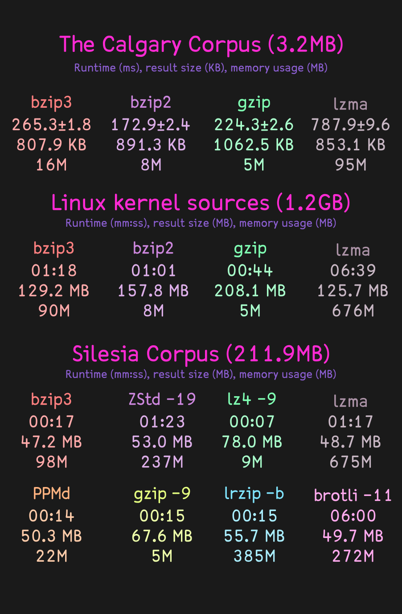

# BZip3

[](https://github.com/kspalaiologos/bzip3/actions/workflows/build.yml)

A better, faster and stronger spiritual successor to BZip2. Features higher compression ratios and better performance thanks to a order-0 context mixing entropy coder, a fast Burrows-Wheeler transform code making use of suffix arrays and a RLE with Lempel Ziv+Prediction pass based on LZ77-style string matching and PPM-style context modeling.

Like its ancestor, **BZip3 excels at compressing text or code**.

## Installation

```console
# If using a git clone (not needed for source packages), first...
$ ./bootstrap.sh

# All...
$ ./configure
$ make
$ sudo make install
```

Alternatively, you might be able to install bzip3 using your system's package manager:

[](https://repology.org/project/bzip3/versions)

On macOS, you can use [Homebrew](https://brew.sh) to easily install:

```console
$ brew install bzip3
```

## Perl source code benchmark

First, I have downloaded every version of Perl5 ever released and decompressed them.

```bash
% wget -r -l1 -nH --cut-dirs=2 --no-parent -A.tar.gz --no-directories https://www.cpan.org/src/5.0/
% for g in *.gz; do gunzip $g; done
% ls -la | wc -l
262
```

Then, I put all the resulting `.tar` files in a single `.tar` file and tried to compress it using various compressors:

```
xz -T16 -9 -k all.tar  10829.91s user 26.91s system 1488% cpu 14658M memory 12:09.24 total
bzip2 -9 -k all.tar  981.78s user 9.77s system 95% cpu 8M memory 17:16.64 total
bzip3 -e -b 256 -j 12 all.tar  2713.81s user 16.28s system 634% cpu 18301M memory 7:10.10 total
bzip3 -e -b 511 -j 4 all.tar  17.65s user 12.19s system 170% cpu 12178M memory 7:08.65 total
zstd -T12 -16 all.tar  4162.94s user 16.40s system 1056% cpu 687M memory 6:35.62 total
```

The results follow:

* LZMA (xz) - 2'056'645'240 bytes
* bzip2 - 3'441'163'911 bytes
* bzip3 -b 256 - 1'001'957'587 bytes
* bzip3 -b 511 - 546'456'978 bytes
* Zstandard - 3'076'143'660 bytes

Finally, wall clock time decompression times (WD Blue HDD):
* LZMA (xz) - 4min 40s
* bzip2 - 9min 22s
* bzip3 (parallel) - 4min 6s
* Zstandard - 3min 51s

Then, I used `lrzip` to perform long-range deduplication on the original `.tar` file:

```
% time lrzip -n -o all_none.tar.lrz all.tar
546.17s user 160.87s system 102% cpu 10970M memory 11:28.00 total

% time lrzip --lzma -o all_lzma.tar.lrz all.tar
702.16s user 161.87s system 122% cpu 10792M memory 11:44.83 total

% time lrzip -b -o all_bzip2.tar.lrz all.tar
563.93s user 147.38s system 112% cpu 10970M memory 10:34.10 total
```

Finally, I compressed the resulting `none.tar.lrz` file using bzip3:

```
% time bzip3 -e -b 256 -j 2 all_none.tar.lrz
32.05s user 0.76s system 146% cpu 2751M memory 22.411 total
```

The results follow:

* lrzip + bzip3 - 60'672'608 bytes.
* lrzip + lzma - 64'774'202 bytes.
* lrzip + bzip2 - 75'685'065 bytes.

For further benchmarks against Turbo-Range-Coder and BSC, check [powturbo's benchmark](https://github.com/powturbo/Turbo-Range-Coder) of bzip3, bzip2, bsc and others.

## Disclaimers

**I TAKE NO RESPONSIBILITY FOR ANY LOSS OF DATA ARISING FROM THE USE OF THIS PROGRAM/LIBRARY, HOWSOEVER CAUSED.**

Every compression of a file implies an assumption that the compressed file can be decompressed to reproduce the original. Great efforts in design, coding and testing have been made to ensure that this program works correctly.

However, the complexity of the algorithms, and, in particular, the presence of various special cases in the code which occur with very low but non-zero probability make it impossible to rule out the possibility of bugs remaining in the program.

DO NOT COMPRESS ANY DATA WITH THIS PROGRAM UNLESS YOU ARE PREPARED TO ACCEPT THE POSSIBILITY, HOWEVER SMALL, THAT THE DATA WILL NOT BE RECOVERABLE.

That is not to say this program is inherently unreliable. Indeed, I very much hope the opposite is true. Bzip3/libbz3 has been carefully constructed and extensively tested.

**Bzip3's performance is _heavily_ dependent on the compiler. x64 Linux clang13 builds usually can go as high as 17MiB/s compression and 23MiB/s decompression _per thread_. Windows and 32-bit builds might be considerably slower.**

Bzip3 has been tested on the following architectures:
- x86
- x86_64
- armv6
- armv7
- aarch64
- ppc64le
- mips
- mips64
- sparc
- s390x

## Corpus benchmarks



Check etc/BENCHMARKS.md for more results.

## Licensing

A breakdown of components and their licenses follows:

- (runtime) The codebase as a whole: Copyright 2022-2023, Kamila Szewczyk (kspalaiologos@gmail.com); LGPL (LICENSE)
- (runtime) The Burrows-Wheeler transform (libsais) and LZP code: 2021-2022, Ilya Grebnov (ilya.grebnov@gmail.com); Apache 2.0 (3rdparty/libsais-LICENSE)
- (compile-time) `build-aux`: Copyright 2011, Daniel Richard G (skunk@iSKUNK.ORG), 2019, Marc Stevens (marc.stevens@cwi.nl), 2008, Steven G. Johnson (stevenj@alum.mit.edu); GPL-3+ with AutoConf exception
- (compile-time) `build-aux/ax_check_compile_flag.m4`: Copyright 2008, Guido U. Draheim (guidod@gmx.de), 2011, Maarten Bosmans (mkbosmans@gmail.com); FSFAP
- (compile-time) `build-aux/git-version-gen`: Copyright 2007-2012, Free Software Foundation, Inc; GPLv3
- (runtime) `bz3grep`: Copyright 2003, Thomas Klausner; BSD-2-clause

`bzip3` as a whole is licensed under LGPLv3 only. It is not dual-licensed under LGPLv3 and Apache 2.0.

## Thanks

- Ilya Grebnov for his `libsais` library used for BWT construction in BZip3 and the LZP encoder which I had used as a reference implementation to improve myself.
- Caleb Maclennan for configuring autotools as a packaging-friendly build system for BZip3.
- Ilya Muravyov for his public domain BWT post-coder, a derivative of which is used in this project.
