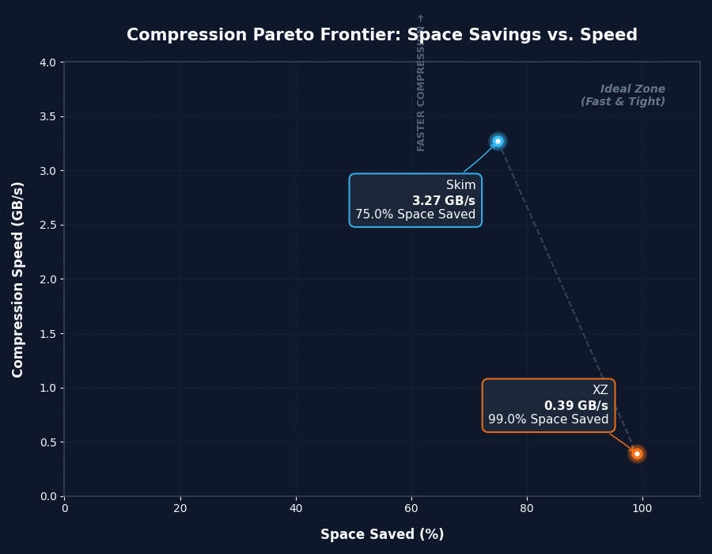

# skim

The fastest compression algorithm ever created.

**Skim sacrifices compression ratio for an absolute maximum throughput.**

## TLDR

All benchmarks are done on my pc. Take them with a grain of salt.

### Skim

- **Speed:** ~3.27 GB/s encoding | ~1.65 GB/s decoding
- **Efficiency:** Compresses 100MB in 30.6 ms.
- **Ratio:** Low | 75% saved for log or repetitive files.

### XZ

- **Speed:** 390.6 MB/s encoding | ~1.14 GB/s decoding
- **Efficiency:** Compresses 100MB in 256.0 ms.
- **Ratio:** High | 99% saved for log or repetitive files.

## Benchmark plot



## Usage

### CLI Tool

#### Compress a file

```bash
skim -c <input_file> <output_file>
```

The argument `<input_file>` can be replaced with `-` to stream from `stdin`.

#### Decompress a file

```bash
skim -d <input_file> <output_file>
```

The argument `<output_file>` can be replaced with `-` to stream to `stdout`.
